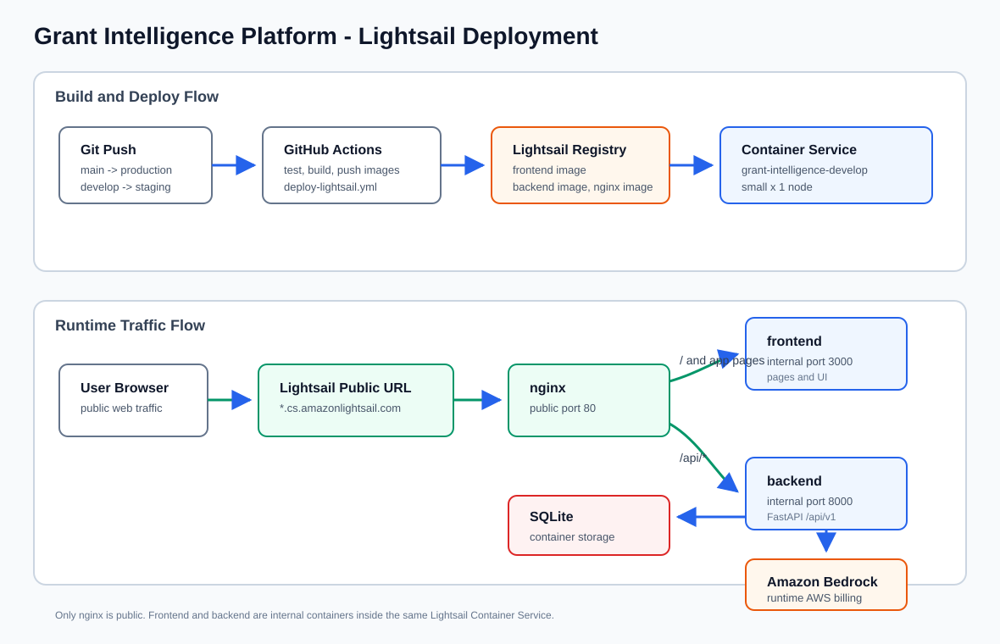

# Lightsail Deployment Guide

This repo deploys the app to Amazon Lightsail Container Services. It does not
create a traditional Lightsail virtual machine instance.

## Current Architecture



Plain-text fallback:

```text
Build/deploy:

Git push to main/develop
  -> GitHub Actions
  -> build frontend, backend, and nginx Docker images
  -> push images to Lightsail registry
  -> create a Lightsail Container Service deployment

Runtime:

User browser
  -> Lightsail public URL
  -> nginx container, public port 80
     -> / and app pages -> frontend container, internal port 3000
     -> /api/*          -> backend container, internal port 8000

Backend:

backend container
  -> SQLite inside container storage
  -> Amazon Bedrock and external APIs
```

### Agent Streaming & Execution Loop Synchronization

```text
[Browser / UI]                  [FastAPI Backend]                 [Agent Execution Loop]
      |                                 |                                   |
      | --- HTTP POST /stream --------> |                                   |
      |                                 | --- Starts Agent Loop ----------> |
      |                                 |                                   | (Step 1: Analyzes inputs)
      | <== SSE Event ("thinking") <=== | <== Yields stage event <========= |
      |                                 |                                   | (Step 2: Invokes Tool / Bedrock)
      | <== SSE Event ("tool_call") <= | <== Yields tool event <========== |
      |                                 |                                   | (Step 3: Receives tool result)
      | <== SSE Event ("progress") <=== | <== Yields intermediate data <=== |
      |                                 |                                   | (Step 4: Completes workflow)
      |                                 | [Auto-saves to SQLite DB]         |
      | <== SSE Event ("result") <===== | <== Yields final output <======== |
      |                                 |                                   |
```

## Containers

The service runs three containers in one Lightsail Container Service.

| Container | Port | Public? | Purpose |
| --- | ---: | --- | --- |
| `nginx` | `80` | Yes | Public entry point and reverse proxy. Routes traffic to the right internal container. |
| `frontend` | `3000` | No | Runs the built frontend app. |
| `backend` | `8000` | No | Runs the FastAPI backend and API routes. |

Only `nginx` is exposed publicly. Requests for `/api/*` are forwarded to the
backend. Everything else is forwarded to the frontend.

In Lightsail, the `nginx` container reaches the sibling containers through
`localhost` and their exposed ports. Locally, Docker Compose uses service names
such as `frontend` and `backend`. The shared `deploy/lightsail/nginx.conf` file
is therefore an Nginx template; the workflow and Compose file provide different
environment values for the upstream hostnames.

## Branches And Services

| Git branch | GitHub environment | Default Lightsail service |
| --- | --- | --- |
| `main` | `production` | `grant-intelligence-main` |
| `develop` | `staging` | `grant-intelligence-develop` |

The GitHub secret `LIGHTSAIL_SERVICE` can override the default service name.

## Current Capacity

The workflow currently creates a missing Lightsail Container Service with:

```yaml
LIGHTSAIL_POWER: small
LIGHTSAIL_SCALE: "1"
```

That means one `small` container-service node.

Important: this only applies when the service is first created. If the Lightsail
service already exists, the workflow does not resize it. Check the real deployed
capacity with:

```bash
aws lightsail get-container-services \
  --service-name grant-intelligence-main \
  --query 'containerServices[0].{name:containerServiceName,state:state,power:power,scale:scale,url:url}' \
  --output table
```

For staging, replace the service name:

```bash
aws lightsail get-container-services \
  --service-name grant-intelligence-develop \
  --query 'containerServices[0].{name:containerServiceName,state:state,power:power,scale:scale,url:url}' \
  --output table
```

## Cost Note

The `$12/month` bundle shown on the Lightsail pricing page is for a Lightsail
Linux/Unix instance with public IPv4. This repo is configured for Lightsail
Containers, which use different power names and prices.

As of 2026-08-11, AWS lists these Lightsail Container Service prices per node:

| Container power | Monthly price | RAM | vCPU |
| --- | ---: | ---: | ---: |
| `nano` | `$7` | `512 MB` | `0.25 shared` |
| `micro` | `$10` | `1 GB` | `0.25 shared` |
| `small` | `$15` | `1 GB` | `0.5 shared` |
| `medium` | `$40` | `2 GB` | `1` |

Current repo setting: `small` x `1`, so the intended container-service cost is
about `$15/month`, plus any data transfer overage and other AWS resources.

The closest container plan above the `$12` instance bundle is `small` at about
`$15/month`:

```bash
aws lightsail update-container-service \
  --service-name grant-intelligence-main \
  --power small \
  --scale 1
```

This is needed for existing services because the workflow capacity setting only
applies when it creates a missing service.

## Bedrock Billing

Yes, the deployed backend can use Amazon Bedrock, and Bedrock usage is billed to
the AWS account whose credentials are available to the running backend
container.

There are two separate AWS identities involved:

| AWS identity | Where it is used | What it pays for |
| --- | --- | --- |
| GitHub Actions deploy identity | `AWS_ACCESS_KEY_ID` and `AWS_SECRET_ACCESS_KEY` GitHub environment secrets | Lightsail service creation, image push, and deployment operations. |
| Backend runtime identity | AWS keys or role values inside `LIGHTSAIL_BACKEND_ENV` | Bedrock model calls made by the running app. |

If both sets of credentials belong to your AWS account, then both Lightsail and
Bedrock charges are on your AWS bill. If the backend runtime credentials belong
to a different AWS account, the Bedrock model calls are billed there instead.

The current agent code calls Bedrock Runtime in `us-east-1` using
`us.anthropic.claude-sonnet-4-6`. AWS bills Bedrock model inference based on
the selected model and token usage. High-traffic usage, long prompts, and large
generated application drafts will increase cost.

To reduce risk before a public launch:

```bash
aws budgets describe-budgets --account-id YOUR_AWS_ACCOUNT_ID
```

Also create an AWS Budget or billing alarm in the AWS Console for Bedrock and
Lightsail before sharing the deployed URL broadly.

## Accessing The Deployed App

After deployment, get the public URL:

```bash
aws lightsail get-container-services \
  --service-name grant-intelligence-main \
  --query 'containerServices[0].url' \
  --output text
```

Open that URL in a browser. The frontend is served from the base URL:

```text
https://SERVICE-NAME.RANDOM.REGION.cs.amazonlightsail.com/
```

The backend health endpoint is available through nginx:

```text
https://SERVICE-NAME.RANDOM.REGION.cs.amazonlightsail.com/api/v1/health
```

Expected health response:

```json
{"status":"ok"}
```

The Lightsail public endpoint health check also uses `/api/v1/health`, routed
through the public `nginx` container to the internal backend container.

## Local Equivalent

Local Docker Compose uses the same shape:

```bash
docker compose -f deploy/lightsail/docker-compose.local.yml up --build
```

Then open:

```text
http://localhost:8080
```

Local routing:

```text
localhost:8080/        -> nginx -> frontend:3000
localhost:8080/api/... -> nginx -> backend:8000
```

## Files To Know

| File | Purpose |
| --- | --- |
| `.github/workflows/deploy-lightsail.yml` | GitHub Actions deployment pipeline. |
| `deploy/lightsail/nginx.conf` | Reverse proxy routing rules. |
| `deploy/lightsail/docker-compose.local.yml` | Local version of the 3-container setup. |
| `frontend/Dockerfile` | Frontend production image. |
| `backend/Dockerfile` | Backend production image. |
| `docs/release-guide.md` | Manual release and production deployment checklist. |

## References

- AWS Lightsail pricing: https://aws.amazon.com/lightsail/pricing/
- AWS Bedrock pricing: https://aws.amazon.com/bedrock/pricing/
- AWS Bedrock cost tracking: https://docs.aws.amazon.com/bedrock/latest/userguide/cost-management.html
- AWS CLI `create-container-service`: https://docs.aws.amazon.com/cli/latest/reference/lightsail/create-container-service.html
- AWS CLI `get-container-services`: https://docs.aws.amazon.com/cli/latest/reference/lightsail/get-container-services.html
- AWS CLI `update-container-service`: https://docs.aws.amazon.com/cli/latest/reference/lightsail/update-container-service.html
